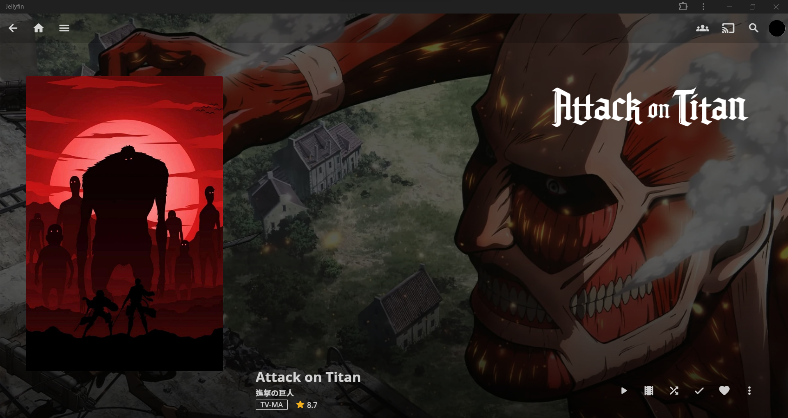

# Jellyfin Better Styles

Jellyfin better styles with stock experience. Works both on desktop and mobile.

## Installation

Add this line to your custom css (Settings => Display => Custom CSS code)

```css
@import url("https://tetrax-10.github.io/jellyfin-better-styles/out/theme.css");
```

## Screenshot


